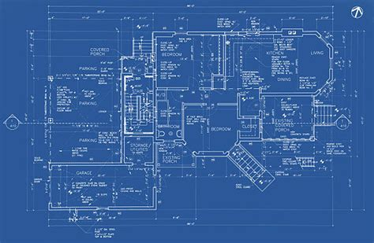

<!-- _class: cover -->
<!-- _paginate: false -->


# Week 2 강의

## 도메인 모델링의 함정

게시판 5초 vs 5시간 · 2026-06-06

---

<!-- _class: quest -->

# 왜 이 주제인가

- 같은 _게시판_ 도 모델링에 따라 5 시간 → 5 초
- W1 에서 만든 코드가 _확장 가능_ 한지는 _모델링_ 이 결정
- 면접 단골: "왜 그 모델로 설계?"
- W2 미션 (JPA) 는 _모델_ 위에서 — 좋은 모델 = 좋은 쿼리

> "도메인 모델은 _건물의 평면도_. 한번 그어지면 바꾸기 어렵다."

---

# 오늘 다루는 것

1. 비유 — 부동산 평면도
2. 같은 게시판 두 모델 비교
3. 페이스북 모델 진화 사례
4. 모델링 5 가지 함정
5. 도메인에서 + 이력서에서

---

# 시작 전 — 용어 카드

| 용어 | 한 줄 정의 |
| --- | --- |
| **도메인 모델** | 비즈니스 개념을 코드로 표현한 것 |
| **Entity** | ID 로 구분되는 객체 (`Post(id, ...)`) |
| **VO (Value Object)** | 값 자체로 비교, ID 없음 (`Money(1000원)`) |
| **애그리거트** | 트랜잭션 경계가 같은 객체 _묶음_ |
| **빈혈 모델** | 데이터만 있고 _행위_ 없는 객체 |

> 자세한 건 강의 안에서. 모르는 단어 나오면 _이 표_ 다시 보기.

---

<!-- _class: quest -->

# Part 1 — 부동산 평면도



- 한 번 그어진 벽 = _허물기_ 어려움
- 잘 그으면 _10년_ 살기 좋음
- 잘못 그으면 _누수·곰팡이_

> "초기 모델링 1 시간 = 운영 1 년 절약."

---

<!-- _class: lesson -->

## 같은 게시판 — 모델 A

```text
Post(id, title, content, author,
     viewCount, likeCount, status,
     scheduledAt, ...)
```

```text
✅ 단순 — 한 테이블
❌ 좋아요 +1 → 본문 락 경합
❌ 통계 추가 → 마이그레이션 큼
```

---

<!-- _class: lesson -->

## 같은 게시판 — 모델 B

```text
Post(id, title, content, authorId)
PostMeta(postId, viewCnt, likeCnt)
PostStatus(postId, status, schedAt)
```

```text
✅ 변경 이유 분리
✅ 좋아요 → PostMeta 만
✅ 락 경합 ↓
❌ 조회 시 조인 1~3 회
```

---

# 결과 비교

| 시나리오 | 모델 A | 모델 B |
| --- | --- | --- |
| 단일 글 조회 | 1 쿼리 | 1~3 쿼리 |
| 좋아요 +1 | UPDATE Post | UPDATE PostMeta |
| 글 수정 | 락 경합 12% | 분리 (X) |
| 통계 추가 | 마이그레이션 | 컬럼만 |

> 단순한 게 _항상_ 좋은 건 아님. _변화 패턴_ 이 모델 결정.

---

<!-- _class: quest -->

# Part 2 — 페이스북 진화

같은 _포스트_ 가 어떻게 진화했나.

- 2004: _글_ — 텍스트 + 시간
- 2010: _상태 업데이트_ — 사진/링크/태그
- 2013: _뉴스피드_ — 알고리즘 정렬
- 2017: _스토리_ — 24시간 휘발
- 2024: _Reels_ — 영상 + 추천

> 모델이 _덧붙는_ 게 아니라 _재설계_ 된 시점이 4 번.

---

# 교훈 — 완벽한 모델은 없다

```text
✅ 처음부터 _작게_, _바꾸기 쉽게_
✅ 명확한 _경계_ (애그리거트)
✅ 책임 _분리_ (변경 이유 다름)

❌ 모든 미래 _예측_
❌ 한 Entity 50 속성
❌ 한 테이블에 _다 때려넣기_
```

> 모델은 _진화_ 한다. 진화하기 _쉽게_ 만드는 게 핵심.

---

<!-- _class: quest -->

# Part 3 — 5 가지 함정

학습자가 자주 빠지는 모델링 실수.

```text
1. God Object       — 한 객체 _다 함_
2. 빈혈 모델        — 데이터만, 행위 X
3. 분기 폭발        — type 검사 50번
4. 양방향 의존      — 순환 참조
5. id-만 객체       — 도메인 언어 X
```

---

# 함정 1 — God Object

```text
class Post {
  String title; User author;
  List<Comment> comments;
  List<Like> likes; List<Tag> tags;
  Statistics stats;
  Notifier notifier;
  // ... 50 개 더
}
```

> 한 객체가 _모든 것_ 책임 → 변경 빈도 ↑, 락 경합 ↑.
> ✅ 애그리거트 분리: Post / PostStats / PostNotification.

---

# 함정 2 — 빈혈 모델

```text
class Post {
  // setter, getter 만
}

class PostService {
  void publish(Post p) { ... }
  void archive(Post p) { ... }
}
```

> 객체 = _데이터 컨테이너_, 행위 _없음_.
> ✅ 도메인 행위는 도메인 객체에: `post.publish()`.

---

# 함정 3 — 분기 폭발

```text
post.publish() {
  if (type == 'NORMAL')   ...
  if (type == 'NOTICE')   ...
  if (type == 'EVENT')    ...
  if (type == 'PRIVATE')  ...
}
```

> 새 타입 1 개 = 메서드 _전부_ 수정.
> ✅ 다형성: NormalPost / NoticePost 분리.

---

# 함정 4 — 양방향 의존

```text
class Post  { List<Comment> comments; }
class Comment { Post post; }

// Post 수정 → Comment 영향
// Comment 추가 → Post 영향
```

> 순환 의존 → 테스트 어려움 + LAZY 함정 + 캐시 무효화 복잡.
> ✅ 한쪽 방향만 (보통 N → 1).

---

# 함정 5 — id 만 있는 객체

```text
class Order {
  Long userId;     // User 아님
  Long productId;  // Product 아님
}

User u = userRepo.findById(order.userId);
```

> _연관_ 의 의도가 _숨음_. 도메인 언어 잃음.
> ✅ Entity 참조 (애그리거트 _안_), id 참조 (애그리거트 _밖_).

---

# 도메인에서 — 좋은 모델의 5 신호

| 신호 | 무엇 |
| --- | --- |
| 변경 이유 _하나_ | 모든 필드가 같은 이유로 변함 |
| 도메인 언어 일치 | 코드 = 비즈니스 용어 |
| 트랜잭션 경계 명확 | 애그리거트 = 트랜잭션 단위 |
| 테스트 _쉬움_ | mock 없이 단위 테스트 |
| 새 기능 _덧붙기_ | 기존 코드 안 건드려도 |

> 5 개 중 3 개+ 만족 = 좋은 모델 출발.

---

# 이력서에서 — 모델링 카드

```text
[게시판 도메인 분리로 락 경합 97% 감소]
P (문제) Post 단일 Entity — 좋아요 +1 시 본문 수정 락 충돌 12%
O (옵션) 비관 락 / 애그리거트 분리 / Redis counter
D (결정) PostStats 애그리거트 분리 — 변경 이유 다름
A (행동) Entity 분리 + 마이그레이션 + 부하 테스트
R (결과) 락 충돌 12% → 0.3% (-97%)
```

---

# AI 보조 — 잘 쓰는 법

- **잘하는 것**: 1 차 Entity 추천, CQRS 같은 일반 패턴 설명
- **자주 hallucinate**: 도메인 _경계_ 추측, 한국 비즈니스 패턴
- **검증 루프**:
  1. AI 모델 받기
  2. 변경 이유 _같은_ 지 검토
  3. 도메인 전문가 / 시니어 페어
  4. _분리 근거_ evidence

---

# 다음 단계 — 미션 연결

- W2 미션 `03-week2-jpa` 의 `entity-design-notes.md` = 본인 모델 _결정 근거_
- W1 단순 모델을 _애그리거트 관점_ 으로 다시 보기
- 연관관계 주인 결정도 _도메인 의미_ 부터

> 막히면 → `{cohort}-질문` 채널 + 오피스아워 (화·목 `21:00`)

---

<!-- _class: end -->

# Q&A

```text
이번 주 = "내 게시판 모델 다시 보기"
다음 면접 = "왜 그 모델?" 답할 수 있게
```

> 다음 격주 강의(W4): **슬로우 쿼리 사례 5선**.
