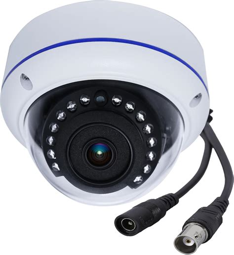

<!-- _class: cover -->
<!-- _paginate: false -->


# Week 6 강의

## 분산 추적의 세계

Netflix 가 본 1 PB 로그 · 2026-07-11

---

# 범인 찾기 🕵️


---

<!-- _class: quest -->

# 왜 이 주제인가

- 단일 서버 → 여러 서버 가면 _프로파일링_ 만으론 부족
- "느려요" 가 _어느 서버_ 의 _어느 단계_ 인지 추적 필요
- W5 동시성 + W6 프로파일링 = 단일 서버 가시성
- 이번 강의 = _여러 서버 가시성_

> "1 개 서버는 _MRI_, 100 개 서버는 _CCTV 망_."

---

# 오늘 다룰 것 📚

1. 비유 — CCTV 망
2. 단일 vs 분산 — 가시성의 차이
3. Trace / Span / Context Propagation
4. OpenTelemetry / Zipkin / Jaeger
5. Netflix·Uber 사례 + 이력서 카드

---

# 시작 전 — 용어 카드

| 용어 | 한 줄 정의 |
| --- | --- |
| **Trace** | 한 요청의 _전체 여정_ (서비스 1 → N 까지) |
| **Span** | Trace 안의 _한 단계_ (서비스 1 개 또는 함수) |
| **Context Propagation** | trace ID 를 서비스 간 _전달_ |
| **OpenTelemetry** | 분산 추적·로그·메트릭 _표준_ (CNCF) |
| **Service Mesh** | 서비스 간 통신을 _인프라_ 가 가로채는 패턴 |

> 모르는 단어 나오면 _이 표_ 다시.

---

<!-- _class: quest -->

# Part 1 — CCTV 망 비유



- 도둑을 _건물 1채_ 안에서 잡기 = 단일 서버
- 도둑이 _10 건물_ 거쳐 도망 = 분산 추적
- 각 건물에 _CCTV_ (= span)
- _시간 동기화_ + 도둑 ID (= trace ID)
- _건물 간 동선_ 재구성 (= context propagation)

> "한 요청을 _시작_ 부터 _끝_ 까지 따라간다."

---

# 단일 vs 분산 — 가시성 차이

| 측면 | 단일 서버 | 분산 시스템 |
| --- | --- | --- |
| 도구 | 프로파일러 | 분산 추적 |
| 단위 | 함수 | 서비스 |
| 어려운 점 | 핫스팟 | _어느 서비스_ |
| 데이터 | flamegraph | trace tree |
| 사례 | async-profiler | Zipkin / Jaeger |

> 마이크로서비스 = _필수_. 모놀리스도 _DB / 캐시 / 외부 API_ 추적.

---

<!-- _class: quest -->

# Part 2 — Trace / Span

```text
[Trace] = 한 요청의 전체 여정
   ↓
[Span 1] gateway       (50ms)
   ├ [Span 2] auth     (10ms)
   ├ [Span 3] order    (200ms)
   │   ├ [Span 4] DB   (180ms)  ← 핫스팟!
   │   └ [Span 5] redis (5ms)
   └ [Span 6] notify   (20ms)
```

> Span 들이 모여 Trace. Span 트리에서 _가장 굵은_ 가지 = 핵심 병목.

---

# Context Propagation

```text
Request → gateway 서비스
  HTTP header: trace-id=abc-123

gateway → order 서비스
  HTTP header: trace-id=abc-123
                 parent-span=g-001

order → DB / redis / notify
  HTTP/RPC header: trace-id=abc-123
                   parent-span=o-002
```

> 모든 호출이 _같은 trace-id_ 공유 → 추적 가능.

---

<!-- _class: lesson -->

## OpenTelemetry — 표준

```text
🌐 OTel = 추적·로그·메트릭 통합 표준 (CNCF)
지원: Java / Python / Go / Node 다수
백엔드: Jaeger / Zipkin / Tempo / Datadog
```

```text
✅ vendor 종속 ↓
✅ 한 SDK 로 모든 언어
```

---

<!-- _class: lesson -->

## Spring Boot 통합

```yaml
management:
  tracing.sampling.probability: 1.0
  zipkin.tracing.endpoint: http://...
```

```text
✅ Spring Boot 3 + Micrometer
✅ HTTP / DB / Redis 자동 계측
```

---

<!-- _class: quest -->

# Part 3 — Service Mesh

```text
지금까지: 코드에 _계측 라이브러리_ 박기
   ↓
2020+ : 인프라가 _자동_ 으로 추적
```

- 모든 서비스 옆에 _sidecar_ (= Envoy proxy)
- Pod 내부 통신을 _가로채서_ 추적
- 코드 변경 _없이_ trace ID 발행 + 전파
- Kubernetes + istio = 지금의 표준

> "추적은 _라이브러리_ 가 아니라 _인프라_ 의 책임이다."

---

<!-- _class: lesson -->

## istio sidecar 동작

```text
[Pod]  App ←→ Envoy ←→ 외부
              (sidecar proxy)
```

Envoy 가 가로채서 trace-id 자동 주입 + Jaeger 전송.

```text
✅ App 코드 _0줄_ 변경
❌ K8s 환경 필요
```

---

<!-- _class: lesson -->

## istio vs Linkerd vs Cilium

| 도구 | 특징 |
| --- | --- |
| **istio** | 가장 _많이_ 쓰임, 기능 풍부 |
| **Linkerd** | _가벼운_ Service Mesh |
| **Cilium** | eBPF 기반 _커널_ 레벨 |
| **Consul** | HashiCorp 통합 |

```text
선택 = 운영 복잡도 vs 기능
공통: _코드 변경 X_ + _자동 추적_
```

---

# 코드 vs 인프라 — trade-off

| | 코드 계측 (OTel SDK) | Service Mesh |
| --- | --- | --- |
| 적용 | 라이브러리 추가 | sidecar 자동 주입 |
| 변경 비용 | 모든 서비스 코드 수정 | 인프라 설정만 |
| 정확도 | 함수 단위까지 | HTTP/RPC 경계만 |
| 운영 | 단순 | K8s 운영 필요 |
| 추천 | 작은 팀·모놀리스 | 대규모 마이크로서비스 |

> 둘 다 _보완_. SDK 로 _깊이_ + Mesh 로 _커버리지_.

---

<!-- _class: quest -->

# Part 4 — 공개 사례

자체 기술 블로그 / 공개 컨퍼런스 발표 기준.

```text
Netflix    — 1 PB / day 추적 데이터
Uber       — Jaeger 를 _자체 개발_ 후 오픈소스
Twitter/X  — Zipkin 을 _자체 개발_ 후 오픈소스
```

```text
일반 회사: SaaS APM (DataDog / NewRelic) 채택 다수
대규모: OSS (Jaeger / Tempo) 자체 운영
```

> 트래픽 큰 회사는 _자체 개발·오픈소스화_ 패턴.

---

# Netflix 의 분산 추적

```text
규모:
  - 1 PB / day 추적 데이터
  - 1 초에 수백만 트랜잭션
  - 700+ 마이크로서비스

도입 효과:
  - 장애 _복구 시간_ 1 시간 → 5 분
  - SLA p99 _안정성_ ↑
  - 새 서비스 _병목 사전 발견_
```

> "추적 _없이_ 마이크로서비스 = 안개 속 운전."

---

# 함정 — 분산 추적의 비용

```text
❌ 모든 요청 추적 → 저장소 폭발
❌ 추적 자체가 _느려짐_ (overhead)
❌ trace-id 안 박힌 _레거시_ 서비스
❌ 시간 동기화 _안 됨_ → 순서 뒤섞임
```

```text
✅ 샘플링 1% (또는 적응형)
✅ 비동기 + 배치 전송
✅ 모든 서비스 _공통 라이브러리_
✅ NTP 동기화
```

---

# 단일 서버에서도 _부분 적용_ 가능

```text
HTTP 요청 → controller → service → repository
              ↓                          ↓
          [span 1]                  [span 2: SQL]
                                          ↓
                                    [span 3: redis]
```

```text
✅ Spring Boot 만으로도 자동 계측
✅ 각 단계 _시간 분포_ 확인
✅ 마이크로서비스 가기 전 _학습_
```

> 부트캠프 학생도 _첫 분산 추적 경험_ 가능.

---

# 실무에서 — 분산 추적 자리

| 도메인 | 추적 패턴 |
| --- | --- |
| 결제 | 주문 → 인증 → PG → DB → 알림 |
| 검색 | 검색 → ES → 캐시 → 추천 |
| 알림 | 트리거 → 큐 → 발송 → 응답 |
| 배달 | 주문 → 매칭 → 라이더 → 추적 |
| 회원가입 | 검증 → DB → 메일 → 분석 |

> 5 개 모두 _여러 서비스_ 거치는 패턴.

---

# 이력서엔 — 분산 추적 카드

```text
[결제 latency p99 5초 → 800ms 개선]
P (문제) 결제 응답 p99 5초 — 어느 단계인지 _추측_
O (옵션) 로그 수집 / APM 도입 / OpenTelemetry
D (결정) OpenTelemetry + Jaeger — 표준 + 무료
A (행동) Spring Boot 통합 + 모든 서비스 적용
R (결과) PG span 4초 발견 → 비동기 변환 → p99 800ms
```

---

# AI 잘 쓰는 법 🤖

- **잘하는 것**: trace tree 해석, 병목 후보 추천
- **자주 hallucinate**: 도구 _옵션_ 잘못, 버전별 차이
- **검증 루프**:
  1. AI 답 받기
  2. 본인 trace 데이터로 _직접_ 확인
  3. 도구 공식 문서 교차
  4. evidence 에 _도입 효과_ 기록

---

# 그럼 미션은? 🎯

- W6 미션 `07-week6-profiling` = 단일 서버 프로파일링
- 분산 추적은 _다음 단계_ — 학생 본인 미션은 단일 서버
- 단, _Spring Boot Actuator + Micrometer_ 만 켜둬도 _기초_ 확보

> 막히면 → `{cohort}-질문` 채널 + 오피스아워 (화·목 `21:00`)

---

<!-- _class: end -->

# 질문 ㄱㄱ ❓

```text
이번 주 = "한 요청 _전체 여정_ 보기"
다음 면접 = "마이크로서비스 추적 어떻게?" 답할 수 있게
```

> 다음 격주 강의(W8): **Event Sourcing — 캐시 너머**.
