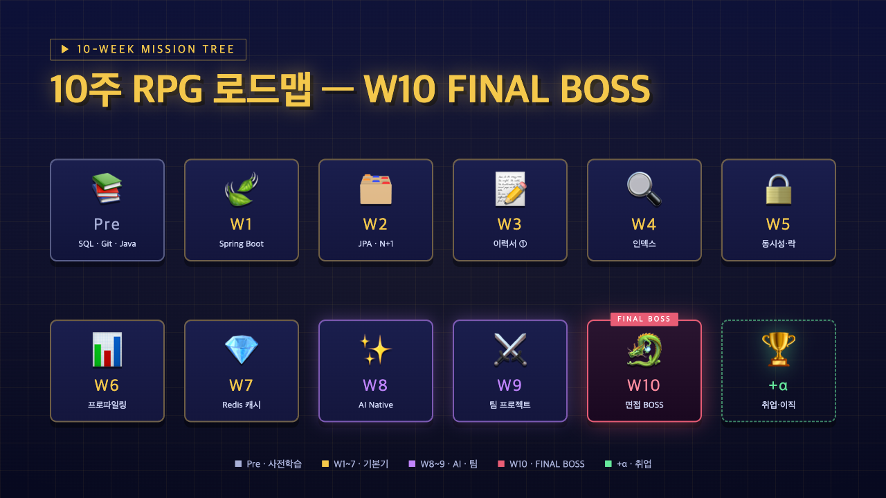
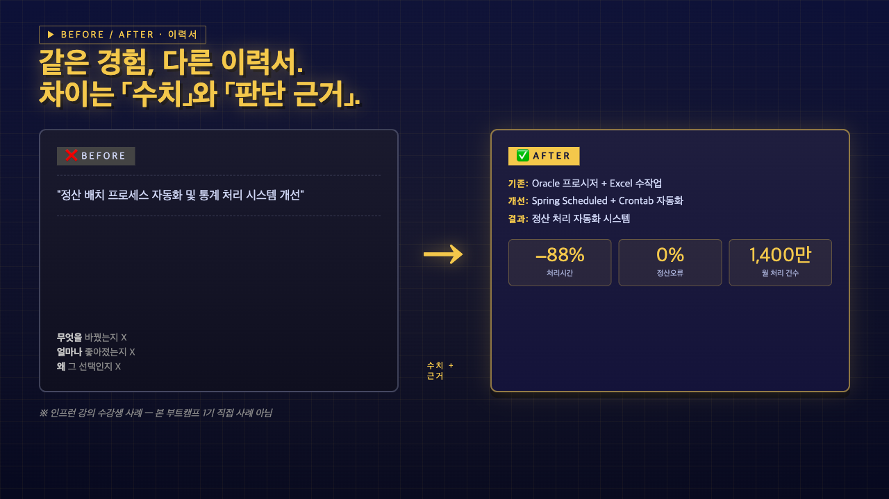
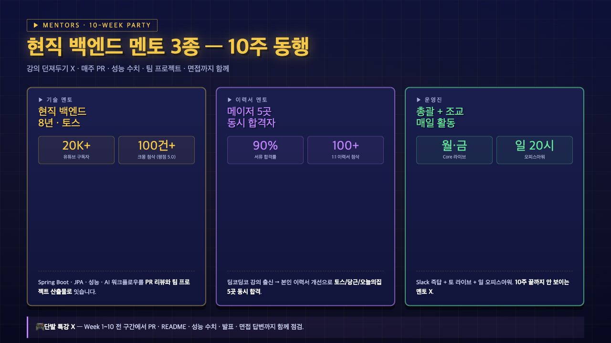
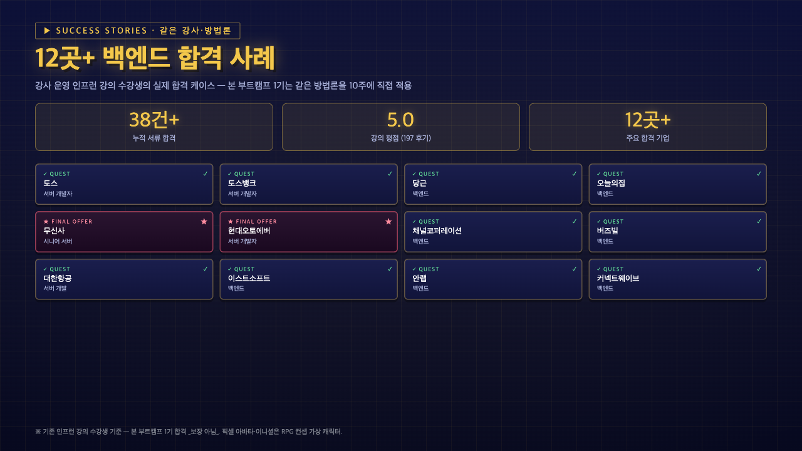
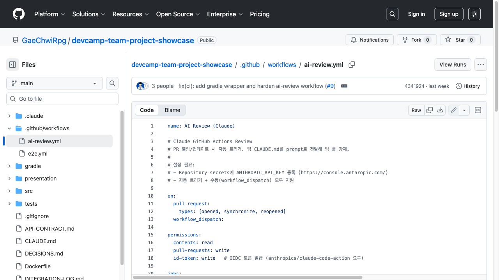
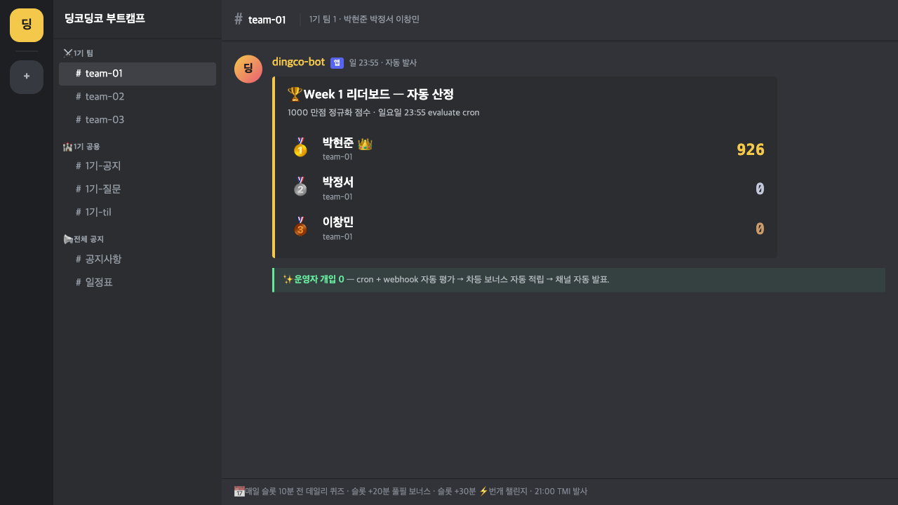

<!-- _class: cover -->
<!-- _paginate: false -->

# Spring 에서 시작해서 AI 로 끝낸다

## 딩코딩코 백엔드 부트캠프 1기

10주 · 주 10~12시간 · 4인 1조 · 채용 담당자가 보는 GitHub

2026-05-17 (일) 설명회 · 모집 마감 **D-6** (5/23)

---

# 오늘 흐름 — 30분 🎯

| # | 블록 | 분량 | 핵심 |
| --- | --- | --- | --- |
| 1️⃣ | **시장의 현실** | 5분 | 왜 지금 — AI 시대 신입의 두 얼굴 |
| 2️⃣ | **우리의 답** | 5분 | 3축 분리 — Pass · AI Native · Team |
| 3️⃣ | **10주 RPG** | 8분 | 로드맵 + AI 사용 정책 |
| 4️⃣ | **산출물 · 신뢰** | 7분 | GitHub · 멘토 · 12곳+ 합격 |
| 5️⃣ | **가격 · 신청** | 5분 | ₩980,000 · D-6 모집 마감 |

> 30분 발표 + 10분 Q&A. 막히는 질문은 끝에 모아서.

---

<!-- _class: quest -->

# 시장의 현실 📉

```text
❌ AI 가 빠르게 만들어주는 코드 — 누구나 가능
❌ "동작은 하는데 왜 그렇게 짰는지" 못 답함
❌ 면접에서 수치 없이 형용사만
```

```text
✅ 채용 담당자가 원하는 건:
   - 본인 손으로 짠 흔적
   - 정량 수치 (응답 ms · QPS · hit rate)
   - 트레이드오프 설명력
```

> 신입 시장 = _빠른 코드 X_, _설명 가능한 코드 O_.

---

# 우리의 답 — 3축으로 분리 🎮

| 구간 | 모드 | 목적 |
| --- | --- | --- |
| **W1~7** | _Pass by Hand_ | 본인 손으로 통과 · AI 보조 가능하나 설명 가능해야 |
| **W8** | _AI Native Workflow_ | 검증 루프 · 프롬프트 팩 · 실패 사례 누적 |
| **W9~10** | _Team Project_ | 4인 팀 · AI 풀가동 + 사람이 모든 PR 검증 |

> _AI 금지_ 도 _AI 던지기_ 도 아닌 **중간 길** — 면접에서 통하는 흔적.

---

# 10주 RPG 로드맵 🗺️

```text
Pre  📚  SQL · Git · Java                  (5/24 ~ 6/5)
───────────────────────────────────────────────────────
W1   🍃  Spring Boot 기본기
W2   🗂️  JPA · 영속성 컨텍스트         특강: 도메인 모델링
W3   📝  백엔드 이력서 차별화
W4   🔍  인덱스 · EXPLAIN              특강: 슬로우 쿼리 5선
W5   🔒  트랜잭션 · 락 · 동시성
W6   📊  성능 최적화 · 프로파일링       특강: 분산 추적
W7   💎  Redis 실전 활용
───────────────────────────────────────────────────────
W8   ✨  AI 네이티브 워크플로우         특강: Event Sourcing
W9   ⚔   팀 프로젝트 구현 가속
W10  🐉  3일 면접 생존 챌린지 — FINAL BOSS
```

> Pre 2주 + W1~10 = **12주 풀 패키지**. _격주 특강 4회 + W10 면접이 진짜 보스_.

---

# 10주 RPG 미션 트리 🌳



> Pre · W1~W7 기본기 · W8~W9 AI·팀 · W10 _FINAL BOSS_ · +α 취업.

---

<!-- _class: lesson -->

# AI 사용 정책 🤖

| 구간 | 모드 | Do | Don't |
| --- | --- | --- | --- |
| **W1~7** | _Pass by Hand_ | 막힐 때 보조 · 그러나 설명 가능해야 | "AI 가 짜준 거예요" 답변 |
| **W8** | _AI Native Workflow_ | 프롬프트 팩 · 검증 루프 · 실패 사례 기록 | 검증 없이 PR |
| **W9~10** | _Team Project_ | AI 풀가동 + 사람이 모든 PR 검증 | AI 결과 그대로 merge |

> _AI 금지 X · AI 던지기 X_. **설명 가능한 AI 활용** 흔적이 면접에서 통함.

---

# 산출물 — 본인 GitHub 📦

```text
10주 후 본인 레포 (GaeChwiRpg/{기수}-{본인}) 누적:

  10+   PR        매주 1건 = 최소 보장
   6+   정량 수치 리포트    W4/5/6/7/9 코드형 + 팀
  10+   AI evidence       매주 prompt log + W8 집중
  12    팀 표준 문서       PRD · API · DECISIONS · ...
   5+   이력서 정량화 bullet  면접에서 그대로
```

> _수료증 X_. **채용 담당자가 GitHub 링크 한 번** → PR diff → 수치 → 면접에서 _말로 답할 수 있는 코드_.

---

# 실제 운영 흔적 — 졸업 팀 PR 10건 ⌚


> _GaeChwiRpg/devcamp-team-project-showcase_ · 4인 1조 · Day 1~5 + Week 10 finale · **10 PRs 모두 merged**.

---

<!-- _class: lesson -->

# 이력서 Before / After 📝

```text
❌ BEFORE — 형용사만
  · "Spring Boot 로 API 개발"
  · "JPA 로 데이터 처리"
  · "성능 개선 경험"
```

```text
✅ AFTER  — 수치 + 트레이드오프
  · 정산 처리 batch p99 −88% (1.4s → 170ms)
  · N+1 4건 잡고 응답 12s → 1.1s, EXPLAIN 첨부
  · Redis 캐시 hit rate 82%, p99 −63%
```

> _같은 경험, 다른 이력서_ — 차이는 「수치」와 「판단 근거」. 면책: 사례 _기존 강의 수강생 기준_.

---

# 수강생 사례 — 정산 배치 −88% 📈



> Oracle 프로시저 + Excel 수작업 (2h) → Spring Scheduled + Crontab E2E 자동화 (15분). 월 1,400만 건 · 오류율 0%.

---

# 멘토 — 10주 동행 👥

| 역할 | 크레덴셜 | 실적 |
| --- | --- | --- |
| **기술 멘토** 🛠️ | 현직 백엔드 **8년** · _토스_ 재직 · 유튜브 **20K** 구독자 | 인프런 100건+ 첨삭 평점 **5.0** |
| **이력서 멘토** 📝 | 딩코딩코 수강생 출신 · 메이저 5곳 동시 합격 | 1:1 첨삭 100+ · 서류 합격률 **90%** |
| **운영진** 🎮 | 총괄 + 조교 1명 | 매주 토 라이브 + 일 오피스아워 + Slack 즉답 |

> _강의 던져두기 X · 리뷰 함께 X · 10주 끝나면 안 보이는 멘토 X_. **함께 끝까지**.

---

# 멘토 3종 — 카드 ⭐



> 기술 멘토 (8년 토스 · 20K) · 이력서 멘토 (5곳 동시 합격 · 90%) · 운영진 (총괄 + 조교).

---

# 신뢰 — 12곳+ 합격 사례 📊

```text
토스 · 당근 · 오늘의집 · 무신사 · 현대오토에버
채널톡 · 버즈빌 · 대한항공 · 카카오모빌리티
LG CNS · 쿠팡 · 라인 외 (12곳+)

평점 5.0  (197건 후기)
누적 합격 38건+  (기존 강의 수강생)
```

> _인프런 기존 강의 수강생 기준_ — 본 부트캠프 1기 합격 _보장 아님_. 정확한 표기.

---

# 합격 사례 12곳 — 회사 그리드 🏆



> ✓ QUEST + ★ FINAL OFFER. 토스 · 토스뱅크 · 당근 · 오늘의집 · 무신사 · 현대오토에버 · 채널 · 버즈빌 ...

---

<!-- _class: lesson -->

# 4인 1조 — 라이프사이클 5단계 👥

| 팀원 | 역할 | 핵심 산출물 |
| --- | --- | --- |
| Alex | 기획 | `PRD.md` + `DECISIONS.md` |
| Bora | 테스트 | Playwright E2E + `.github/e2e.yml` |
| Chris | 리뷰 | Claude GitHub Actions AI 리뷰어 |
| Dasol | 배포·운영 | `MONITORING.md` + Sentry + Docker |

<div>

1. <span data-marpit-fragment="1">**기획** → PRD · API 계약 작성</span>
2. <span data-marpit-fragment="2">**코딩** → 4인 분담 + Phase 1~3 PR</span>
3. <span data-marpit-fragment="3">**테스트** → E2E · 자동화</span>
4. <span data-marpit-fragment="4">**리뷰** → AI + 사람 교차 피어리뷰</span>
5. <span data-marpit-fragment="5">**배포·운영** → 모니터링 · 에러 추적</span>

</div>

---

# 12개 표준 문서 📂

| 문서 | 1줄 설명 |
| --- | --- |
| `PRD` · `DECISIONS` | 요구사항 + 의사결정 ADR |
| `API-CONTRACT` | endpoint 계약 |
| `CLAUDE.md` | AI 헌법 (6요소) |
| `LIFECYCLE-COVERAGE` | 5단계 통과 매트릭스 |
| `MONITORING` · `INTEGRATION-LOG` | 운영·알림 + Day 1~5 일지 |
| `RETROSPECTIVE` · `INTERVIEW-ANSWERS` | 10주 회고 + 면접 답변 카드 |

> 5단계 누가 무엇 했는지 _문서로 증명_ — 그대로 면접 답변 근거.

---

# 실제 레포 파일 트리 📁


> `.claude/` · `.github/workflows/` · `presentation/` · `src/` · `tests/e2e/` + `API-CONTRACT.md` · `CLAUDE.md` · `DECISIONS.md` ...

---

# 졸업 팀 사례 — 운영 티켓 시스템 🎮

```text
사내 IT 운영팀 슬랙 티켓 한 곳에 모으고 SLA + AI 리뷰
4인 1조 · 10주 클리어 · 23 commits · 10 PR · 12 문서
```

| 단계 | 산출물 | AI 도구 | 통과 |
| --- | --- | --- | --- |
| 기획 | `PRD` + `DECISIONS` | Jira MCP + AI PRD | ✅ |
| 코딩 | `src/` + `API-CONTRACT` | Claude.md + Hooks | ✅ |
| 테스트 | `tests/e2e` + `e2e.yml` | Playwright MCP | ✅ |
| 리뷰 | `ai-review.yml` | Claude GitHub Actions | ✅ |
| 운영 | `MONITORING` + Docker | Sentry MCP 가이드 | ✅ |

> 레포: `github.com/GaeChwiRpg/devcamp-team-project-showcase`.

---

# 졸업 팀 README — 가상 팀 + Day 5 📋


> Alex / Bora / Chris / Dasol · Day 1~5 PR 매트릭스 · 핵심 문서 list.

---

# AI 리뷰어 PR — 실제 merge 흔적 🤖


> Day 4 — Claude GitHub Actions AI 리뷰어 도입 · _Merged_.

---

# Claude AI Review 워크플로우 ⚙️



> `.github/workflows/ai-review.yml` · PR 열림/업데이트 시 자동 트리거 · 팀 CLAUDE.md 룰을 prompt 로 강제.

---

# 주간 리듬 — 평일 + 주말 🗓️

```text
월  20:00–22:00   Kickoff (주간 미션 공개 · Q&A)
화  자율 학습      녹화본 + Slack 멘토 Q&A
수  자율 학습      자율 학습
목  자율 학습      자율 학습
금  20:00–22:00   미션 마감 (PR 제출 · 코드리뷰)
토  14:00–16:30   라이브 (격주 특강 + 내부 발표)
일  20:00–22:00   오피스아워 (자유 질문)
```

> _월·금·토 핵심 참여일_. 나머지는 녹화본 + 자율. 주 10~12시간.

---

# Discord 서버 — 운영 체계 💬


> 채널: 전체 공지 / 1기 공용 / 1기 팀. dingco-bot 10주 일정 + 평일 20~22 공식 활동.

---

# 🎮 1500점 leaderboard — 11종 자동 발사

| 카테고리 | 만점 | 적립 |
| --- | --- | --- |
| 미션 | **400** | AI 코드 리뷰 점수 × 8 누적 |
| AI 리뷰 | **200** | 동료 PR 리뷰 quality → +5/+8/+10 자동 |
| 출석 | **200** | 체크아웃 1회 = +4 |
| 이력서·팀 PJ | 200 | W3 이력서 · W9 팀 프로젝트 |
| **🎁 보너스** | **500** | 데일리 퀴즈 · 풀필 · 번개 · 팀퀴즈 · TMI · 12 미니게임 · 게임 unlock · 결과 발표 |

> 운영자 개입 **0** — cron + webhook 자동 발사 · 평가 · 적립. _학습이 곧 점수 · 점수가 곧 게임_.

---

# 🏆 Week 1 리더보드 자동 발표



> 일요일 23:55 evaluate cron → 차등 보너스 자동 적립 → 팀 채널 자동 발표. _internal-test-0510_ 실 운영 캡처.

---

<!-- _class: lesson -->

# 누구에게 추천 / 비추천 ✅❌

### ✅ 이런 분께 추천

- 비전공자 / 직장인 — 평일 저녁 + 주말 학습 가능
- Java 기초 + IntelliJ + Git 흐름 _이미_ 있음
- 동시성·쿼리·성능 막혀서 면접 탈락 경험
- _설명 가능한_ 코드 + _수치_ 가 필요한 사람

### ❌ 이런 분께는 비추

- Node / Python / Go 등 다른 스택 만 쓸 사람
- 주 10시간 미만 학습 가능자
- 수료증 한 장이 목적인 사람

---

# FAQ 5선 ❓

| Q | A |
| --- | --- |
| 비전공자도? | 사전학습 2주로 Git/SQL/Java 기초 맞춤. W1부터 Spring Boot 따라가며 보충. |
| AI 써도? | W1~7 사용 OK 단 설명 가능해야 인정. W8부터 AI 자체가 학습 주제. |
| 라이브 필수? | 월·금·토 필수 (kickoff·마감·미션). 나머지는 권장 + 녹화본 제공. |
| Node.js 가능? | ❌ Java + Spring (Kotlin OK). 미션·리뷰·평가 정상 작동 안 함. |
| 환불? | 2026-05-24 사전학습 시작 전까지 100% 환불. 이후 주차별 차감. |

---

# 가격 · 환불 💰

```text
정가:        ₩1,400,000
1기 런칭가:  ₩980,000   (30% 할인)
환불:        2026-05-24 사전학습 시작 전 100% · 이후 주차 차감
```

**📦 가격 포함**:

- 사전학습 2주 + 본과정 10주 + 4인 팀 운영
- Google Meet 라이브 + 녹화본 + 멘토 즉답
- 매주 PR 리뷰 + AI 검증 흔적 + 최종 면접 답변 정렬
- 1기 한정 혜택 (다음 슬라이드)

---

# 🎁 인프런 7강 영구 시청권

| # | 강의 | 가격 |
| --- | --- | --- |
| 1 | AI한테 시키기 전에 알아야 할 **SQL/DB 초기초** | ₩9,900 |
| 2 | AI한테 시키기 전에 알아야 할 **Git 초기초** | ₩9,900 |
| 3 | **[Lv1]** 면접에서 설명할 수 있는 Spring Boot | ₩88,000 |
| 4 | **[Lv2]** 현업 개발자의 JPA 완전 정복 | ₩99,000 |
| 5 | **6주 완성** — 백엔드 이력서 차별화 전략 4가지 | ₩297,000 |
| 6 | **The 10x** AI-Native Developer | ₩198,000 |
| 7 | **3일 완성** — 백엔드 면접 핵심 압축 공략집 | ₩33,000 |

> 정가 합산 **₩744,800** · 부트캠프 종료 후 평생 소장. + **1등 팀** 이력서 1:1 첨삭.

---

<!-- _class: end -->

# Press Start 🚀

```text
모집           2026-05-08 ~ 2026-05-23  ← 오늘 D-6
사전학습       2026-05-24 ~ 2026-06-05  (2주)
정규 시작      2026-06-06 (토)  · W1 Kickoff
최종 발표      2026-08-15 (토)  · W10 Final

지원하기   →   Latpeed 통합 폼  (1기 지원)
무료 상담  →   Kakao Open Chat
```

**오늘 결정 안 해도 OK** — 결정은 _미루지 마세요_. 모집 마감 **D-6**.
