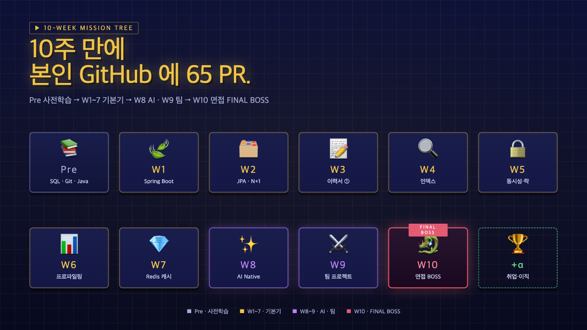
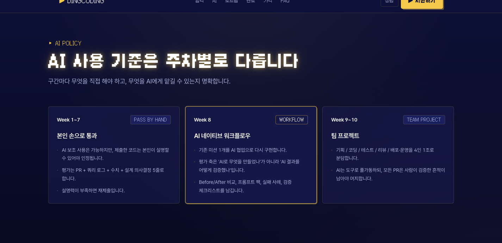
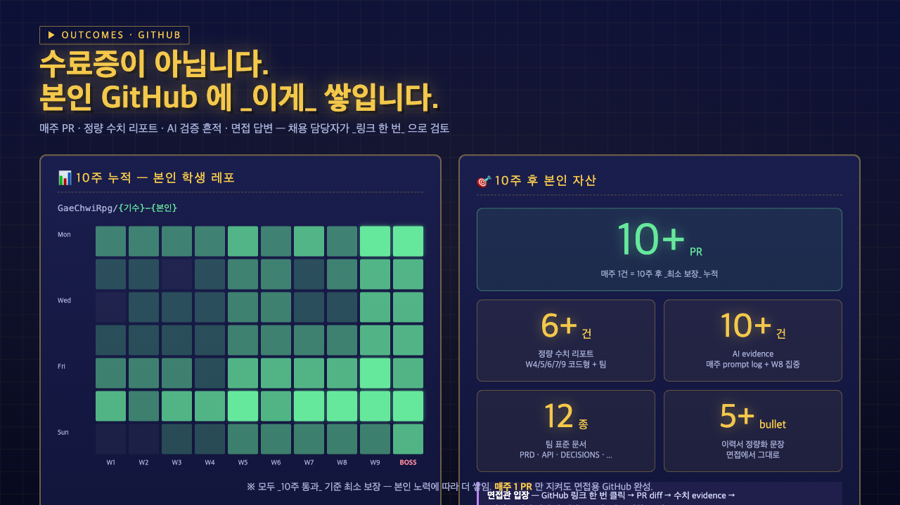
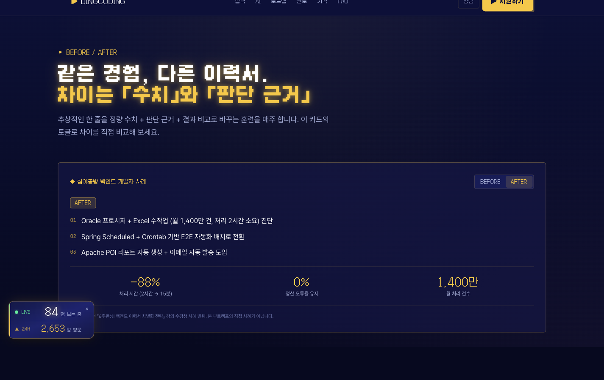
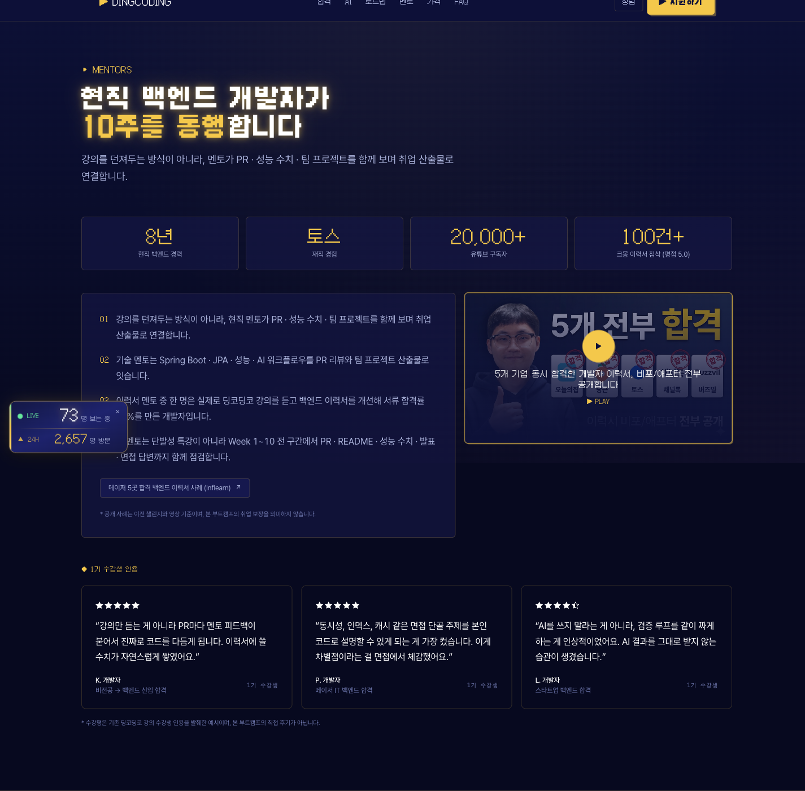
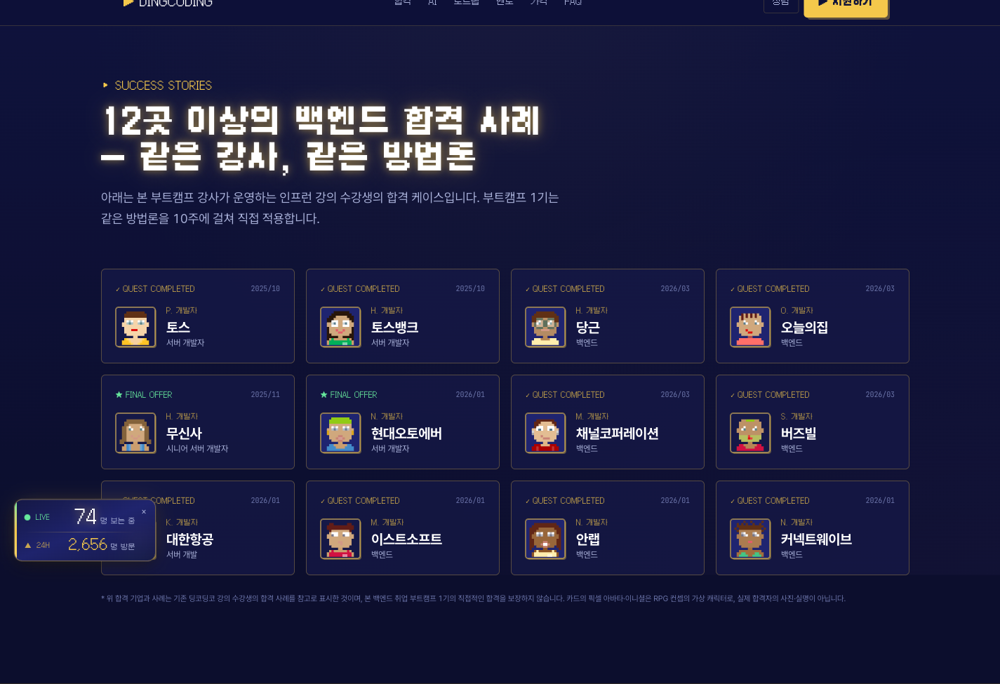
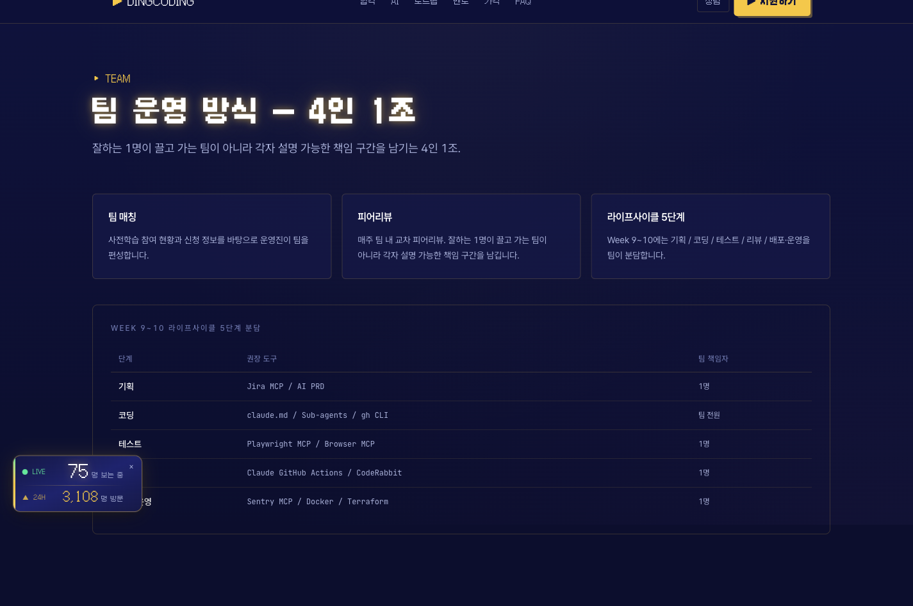
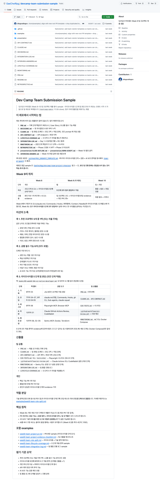
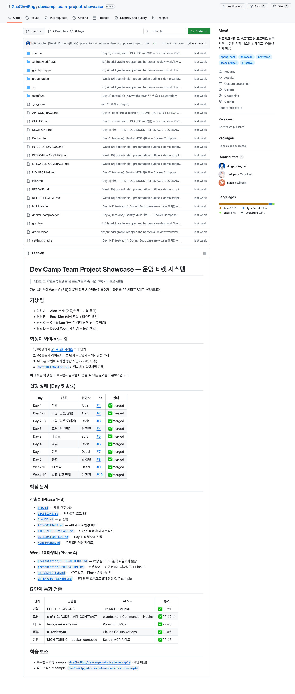
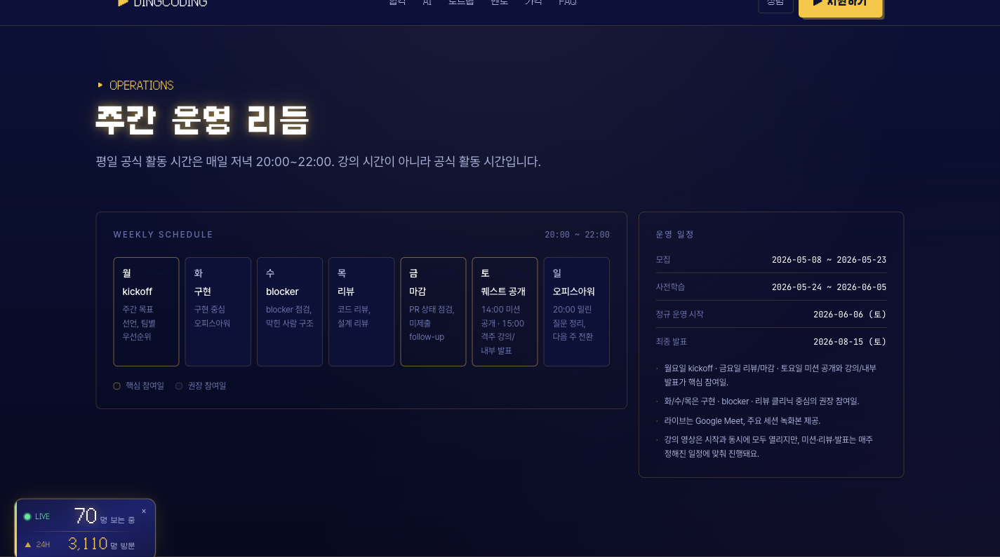

<!-- _class: cover -->
<!-- _paginate: false -->


# Spring 에서 시작해서 AI 로 끝낸다

## 딩코딩코 백엔드 부트캠프 1기

10주 · 주 10~12시간 · 4인 1조 · 채용 담당자가 보는 GitHub

2026-05-17 (토) 설명회 · 모집 마감 **D-6** (5/23)

---

# 오늘 흐름 — 30분 🎯

1. 시장의 현실 — 왜 지금?
2. 우리의 답 — 3축으로 분리
3. 10주 RPG 로드맵 + AI 사용 정책
4. 산출물 + 멘토 + 신뢰
5. 가격 · 일정 · 신청

> 30분 발표 + 10분 Q&A. 막히는 질문은 끝에 모아서.

---

<!-- _class: quest -->

# 시장의 현실 📉

```text
❌ AI 가 빠르게 만들어주는 코드 — 누구나 가능
❌ "동작은 하는데 왜 그렇게 짰는지" 못 답함
❌ 면접에서 수치 없이 형용사만
```

```text
✅ 채용 담당자가 원하는 건:
   - 본인 손으로 짠 흔적
   - 정량 수치 (응답 ms · QPS · hit rate)
   - 트레이드오프 설명력
```

> 신입 시장 = _빠른 코드 X_, _설명 가능한 코드 O_.

---

# 우리의 답 — 3축으로 분리 🎮

| 구간 | 모드 | 목적 |
| --- | --- | --- |
| **W1~7** | _Pass by Hand_ | 본인 손으로 통과 · AI 보조는 가능하나 설명 가능해야 |
| **W8** | _AI Native Workflow_ | 검증 루프 · 프롬프트 팩 · 실패 사례 누적 |
| **W9~10** | _Team Project_ | 4인 팀 · AI 풀가동 + 사람이 모든 PR 검증 |

> _AI 금지_ 도, _AI 던지기_ 도 아닌 **중간 길** — 면접에서 통하는 흔적.

---

<!-- _class: quest -->

# 10-Week RPG Map 🗺️



---

# AI 사용 정책 — 주차별 모드 🤖



> _AI 도 못 다루면 도태_, _AI 만 믿으면 면접 탈락_. — 중간 길을 박는다.

---

# 산출물 — GitHub 누적



> **수료증이 아닙니다.** 본인 GitHub 에 _PR 65개 · 정량 수치 · evidence_ 누적 — 채용 담당자가 링크 한 번으로 검토.

---

# 이력서 Before/After 📝



> 정산 처리 **−88%** · 오류율 0% · 1,400만 건 자동화. _인프런 강의 수강생 기준_.

---

# 멘토 — 10주 동행 👥



> **8년 토스** + **유튜브 20K** · 100건+ 첨삭 평점 5.0 / 이력서 멘토 합격률 **90%**. _강의 던져두기 X · 리뷰 함께_.

---

# 신뢰 — 12곳+ 합격 사례 📊



> 토스 · 당근 · 오늘의집 · 무신사 · 현대오토에버 · 채널 · 버즈빌 · 대한항공 외. _인프런 기존 강의 수강생 기준_ — 본 부트캠프 1기 합격 보장 아님.

---

# 4인 1조 — 라이프사이클 5단계 🤝



> 4명이 _기획 · 코딩 · 테스트 · 리뷰 · 배포_ 5단계 분담 + 교차 피어리뷰.

---

<!-- _class: lesson -->

# 12개 표준 문서 📂



> _PRD / API-CONTRACT / DECISIONS / LIFECYCLE-COVERAGE / MONITORING / RETROSPECTIVE / INTERVIEW-ANSWERS / ..._
> 5단계 누가 무엇을 했는지 _문서로 증명_ — 그대로 면접 답변 근거.

---

# 졸업 팀 사례 🎯



> [devcamp-team-project-showcase](https://github.com/GaeChwiRpg/devcamp-team-project-showcase) — Spring Boot · JPA · Redis · Docker + 라이프사이클 5단계 모두 적용된 완성품. 4명 팀이 10주 후 _이 정도_ 까지.

---

# 주간 리듬 — 평일 + 주말 🗓️



> 평일 `20:00–22:00` 공식 활동 · 토 14/15 라이브 · 일 20–22 오피스아워. _월·금·토 핵심 참여일_.

---

# 누구에게 추천 / 비추천 ✅❌

**✅ 추천**:

- 비전공자 / 직장인 — 평일 저녁 + 주말 학습 가능
- Java 기초 + IntelliJ + Git 흐름은 _이미_ 있음
- 동시성 · 쿼리 · 성능 막혀서 면접 탈락 경험
- _설명 가능한_ 코드와 _수치_ 가 필요한 사람

**❌ 비추천**:

- Java/Spring 외 다른 스택 (Node/Python/Go) 만 쓸 사람
- 주 10시간 미만 학습 가능자
- 수료증 한 장이 목적인 사람

---

# FAQ 5선 ❓

| Q | A |
| --- | --- |
| 비전공자도? | 사전학습 2주로 Git/SQL/Java 기초 맞춤. W1부터 Spring Boot 따라가며 보충. |
| AI 써도? | W1~7 사용 OK 단 설명 가능해야 인정. W8부터 AI 자체가 학습 주제. |
| 라이브 필수? | 월·금·토 필수 (kickoff·마감·미션). 나머지는 권장 + 녹화본 제공. |
| Node.js 가능? | ❌ Java + Spring (Kotlin OK). 미션·리뷰·평가 정상 작동 안 함. |
| 환불? | 2026-05-24 사전학습 시작 전까지 100% 환불. 이후 주차별 차감. |

---

# 가격 & 환불 💰

```text
정가:      ₩1,400,000
1기 런칭가: ₩980,000  (30% 할인)
```

**환불 정책**:

- 2026-05-24 _사전학습 시작 전_ : **100% 환불**
- 사전학습 시작 후 ~ 정규 시작 전: 강의 지급 기준 부분 환불
- 정규 운영 시작 후: 주차 진행 차감
- 목표: 환불 요청 후 _7영업일_ 이내 처리

> 사전학습 2주 + 본과정 10주 + 4인 팀 + 라이브 + 녹화 + 멘토 _모두 포함_.

---

# 1기 한정 혜택 🎁

**① 인프런 강의 7개 일괄 제공** (2026-05-24 사전학습 시점):

- SQL / DB 핵심 (2시간 속성)
- Git 기본기
- 면접에서 '설명할 수 있는' 코드 만들기 (LV1)
- JPA Mastery (LV2)
- 6주완성 백엔드 이력서 돋보이는 법
- The 10x AI-Native Developer
- 3일완성 백엔드 면접 생존 챌린지

**② 최종 발표 1등 팀** — 이력서 1:1 첨삭 (팀원 4명 전원, 재제출 1회 포함)

---

# 일정 📅

```text
모집           2026-05-08 ~ 2026-05-23  ← 오늘 D-6
사전학습       2026-05-24 ~ 2026-06-05  (2주)
정규 시작      2026-06-06 (토)  · W1 Kickoff
최종 발표      2026-08-15 (토)  · W10 Final
```

> 모집 마감 후 정원 마감 시 _대기열_ 운영. _빠른 신청_ 권장.

---

<!-- _class: end -->

# Press Start 🚀

```text
지원하기   →  Latpeed 통합 폼  (1기 지원)
무료 상담  →  Kakao Open Chat
```

**오늘 결정 안 해도 OK** — 결정은 _미루지 마세요_.

> 모집 마감 **D-6** (2026-05-23). 사전학습은 5/24 일괄 시작.
