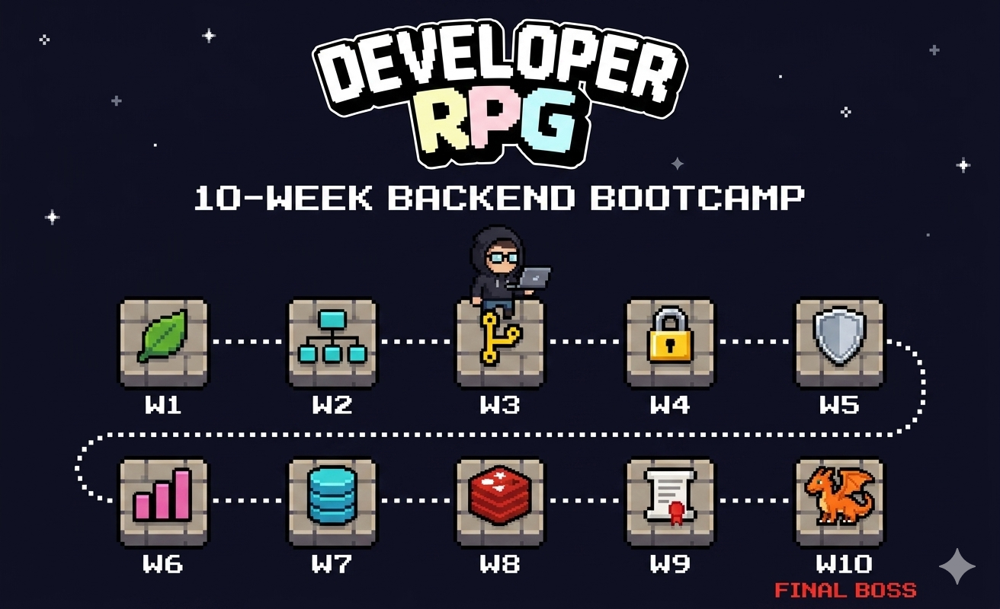

<!-- _class: cover -->
<!-- _paginate: false -->



# Week 1 OT

## 10-Week Backend Bootcamp Begins

2026-05-30 (토) · 오프라인 저녁 모임

---

# 오늘의 흐름

1. 우리가 깨야 할 4가지
2. 10-Week RPG 로드맵
3. 평가 / 통과 기준 / 팀
4. Discord · 제출 시스템 흐름
5. 첫 주 시작 신호 + 네트워킹

> _90분_ 안에 끝납니다. 막히는 곳은 다음 주 토 14:00 에 다시.

---

<!-- _class: quest -->

# 우리가 만들 10주

- _말로 답할 수 있는_ 백엔드 코드 — 면접에서 본인 입으로 본인 코드를
- 책 한 권의 7주차 베이스 + AI Native 4 요소 결합
- 매주 검증 루프 — `mission-guard` CI · AI 리뷰 · 피어리뷰
- 누적되는 PR = 10주 후의 _포트폴리오_

> "이 10주가 끝나면, 본인 코드의 _왜_ 를 답할 수 있다."

---

# 우리가 깨야 할 4가지

- 강의는 _쉽게_ 설명되지만, 실무는 _어렵게_ 굴러간다
- 코드는 돌아가지만 _왜_ 그렇게 짰는지 못 답한다
- AI 가 만들어준 코드의 _hallucination_ 을 못 거른다
- 면접에서 _수치_ 를 가지고 답을 못 한다

> 매주 미션이 이 4가지를 _번갈아_ 깬다 — 1주차부터.

---

# 해결 — 3축 압축

| 축 | 내용 |
| --- | --- |
| **6 공통 필수 기능** | 권한 / 동시성 / 검색 / 캐시 / 비동기 / AI |
| **라이프사이클 5 단계** | 기획 → 코딩 → 테스트 → 리뷰 → 운영 |
| **AI Native 4 요소** | Context Engineering / Slash Commands / Hooks / Sub-agents |

> 모든 미션은 이 3축을 _최소 1번씩_ 통과시킨다. 팀 프로젝트는 _전부_ 통과.

---

# 10-Week RPG Map ① — W1~W5

| 주차 | 미션 ID | 주제 | 통과 조건 |
| --- | --- | --- | --- |
| W1 | `02-week1-spring-boot` | Spring Boot 기본기 | PR 머지 + 팀 규칙 |
| W2 | `03-week2-jpa` | JPA 연관관계 / 영속성 | SQL 로그 차이 설명 |
| W3 | `04-week3-backend-resume` | 이력서 스토리라인 | 정량 bullet 5+ |
| W4 | `05-week4-index` | 인덱스 / EXPLAIN | before/after 비교표 |
| W5 | `06-week5-concurrency` | 트랜잭션 / 락 / 동시성 | 실패 + 성공 로그 |

> W4 종료 시 _누적 평균_ 으로 코드형 미션 진입 자격 확인.

---

# 10-Week RPG Map ② — W6~W10

| 주차 | 미션 ID | 주제 | 통과 조건 |
| --- | --- | --- | --- |
| W6 | `07-week6-profiling` | 서버 성능 최적화 | 핵심 병목 1+ 개선 |
| W7 | `08-week7-redis` | Redis 실전 활용 | 캐시 hit rate 리포트 |
| W8 | `09-week8-ai-native` | AI 네이티브 워크플로우 | 6 evidence + 라이프사이클 2+ |
| W9 | `week9-team-project` | 팀 프로젝트 (5단계 분담) | 개인 PR 2+ + 통합 테스트 |
| W10 | `10-week10-interview` | **FINAL BOSS** — 면접 | 6 evidence + 발표 + 수료 |

> W8 종료 시 _팀 프로젝트 진입 조건_ = 6 공통 + 라이프사이클 2+ 흔적.

---

# 6 공통 필수 기능

- **권한 / 인가** — `@PreAuthorize` / 토큰 검증 / 인가 예외
- **트랜잭션 / 동시성** — `@Transactional` / `@Lock` / 재시도 정책
- **검색 / 인덱스** — `EXPLAIN` 으로 쿼리 플랜 읽기 / 복합 인덱스
- **캐시** — Redis hit rate / TTL / invalidation 전략
- **비동기 / 이벤트** — `@Async` / 이벤트 기반 책임 분리
- **AI 보조 기능** — 검증 루프 + hallucination 추적 + evidence 누적

> 팀 프로젝트는 _6 영역 모두_ 한 번씩 — 분담 매트릭스로.

---

<!-- _class: lesson -->

# 라이프사이클 5 단계 — 산출물

각 단계마다 _남기는 것_ 이 면접 답변의 근거가 된다.

| 단계 | 산출물 | 도구 |
| --- | --- | --- |
| 기획 | `PRD.md` + 티켓 분해 | Jira MCP |
| 코딩 | PR + 테스트 + evidence | Claude Code |
| 테스트 | E2E + 부하 시나리오 | Playwright MCP |
| 리뷰 | AI Actions / CodeRabbit | GitHub Actions |
| 운영 | `MONITORING.md` + 알림 | Sentry MCP |

```text
🎯 한 PR 안에서 본인이 책임진 단계가 무엇인지
   PR 본문 체크박스로 명시 — 9주차 팀에서 강제됨.
```

---

# AI Native 4 요소

- **Context Engineering** — `CLAUDE.md` = 본인/팀의 _합의 헌법_
- **Slash Commands** — 자주 하는 작업을 _명령_ 으로 굳히기
- **Hooks** — `pre-commit` / `pre-push` 검증 자동화
- **Sub-agents** — 병렬 작업 / 독립 검증 / 코드 리뷰 분리

> 매 미션마다 `evidence/prompt-log.md` + hallucination 잡힌 사례 1건 누적.

---

# 평가 — 5축 채점

| 축 | 1점 | 3점 | 5점 |
| --- | --- | --- | --- |
| 요구사항 충족 | 일부 누락 | 모두 충족 | 추가 케이스 |
| 구조 | 절차 나열 | 책임 분리 | 일관 패턴 |
| 기술 적용 | 동작만 | 의도 적용 | 다른 선택지 비교 |
| 검증 근거 | 텍스트만 | 수치 1개 | before/after + p95 |
| 설명력 | 정보 부족 | 의도 전달 | 팀원이 읽고 바로 이해 |

> 5축 평균 = `overall_score`. 매주 평균 ≥ 3.0 이면 통과.

---

# 분기점 5개 — 큰 그림

- **매주**: mission-guard CI green + 5축 평균 ≥ **3.0**
- **W4 누적**: 코드형 미션(W4~7) 진입 자격 — 누적 평균 + 환경 셀프체크 통과
- **W8 종료**: _팀 프로젝트 진입_ — 6 공통 + 라이프사이클 ≥ 2 단계 흔적
- **W9 팀**: 개인 PR ≥ 2 + 5 단계 모두 적용 흔적 + 통합 테스트
- **W10 최종**: 6 evidence + 이력서 최종본 + 발표 + 수료

---

# 팀 매칭 룰

- 4명 팀 기본 (3·5명도 OK — 매트릭스 조정)
- _기술 영역 4종_ × _라이프사이클 5단계_ 매트릭스로 분담
- 팀별 1개 레포 (`{cohort}-team-NN`) 자동 부트스트랩 — 9주차 시작 시점에 활성화
- 팀 헌법 = `CLAUDE.md` 공동 작성 (W9 첫날)
- 9주차 PR 본문에 본인 _기술 영역 + 라이프사이클 단계_ 체크박스 강제

> 분담 sample: `devcamp-team-submission-sample/examples/week9-team-role-split.md`

---

<!-- _class: lesson -->

# 제출 시스템 — 개요

검증은 _자동_, 피드백은 _즉시_.

- 학생 1인 1레포 — `{cohort}-{username}` (이미 부트스트랩 완료)
- 미션 폴더 = mission_id (`02-week1-spring-boot/` 등)
- `submit/<mission_id>` 브랜치에 PR 생성
- mission-guard CI → AI 리뷰 → DB 점수 갱신 → Discord 알림

```text
📌 본인 레포 = 부트캠프 진행 동안 본인의 작업 공간
📌 fork 안 함 — 처음부터 본인 소유
📌 main 직접 push 금지 — 항상 PR
```

---

# Discord 코호트 채널 안내

| 용도 | 채널 |
| --- | --- |
| 질문 / 문제 해결 | `{cohort}-질문` |
| PR / AI 리뷰 알림 | `{cohort}-리뷰` |
| 매일 학습 로그 (TIL) | `{cohort}-til` |
| 자유 / 잡담 | `{cohort}-자유` |
| 공식 공지 | `{cohort}-공지` |
| 본인 학습 블로그 | `{cohort}-blog` |
| 팀 전용 채널 | `{cohort}-team-NN` |
| 졸업 후 | `졸업생-라운지` |

> 오피스아워 = 화·목 `21:00` `{cohort}-질문` 채널 스레드.

---

# 제출 흐름 6단계

1. 본인 학생 레포 clone — `git clone git@github.com:GaeChwiRpg/{cohort}-{username}.git`
2. `02-week1-spring-boot/project/` 에 Spring Boot 코드 작성 + commit
3. `submit/02-week1-spring-boot` 브랜치 push → PR 생성
4. mission-guard CI 가 _내용_ 검증 (red 시 메시지 직접 확인)
5. 통과 시 AI 리뷰 한국어 코멘트 + 5축 점수
6. `{cohort}-리뷰` 채널 알림 + DB `latest_score` 업데이트

> sample repo `GaeChwiRpg/devcamp-submission-sample` 의 PR 들을 _참고_ — 같은 형식.

---

# mission-guard 가 막는 것

- `report.md` 가 체크박스만 있고 본문 비어있는 경우
- `evidence/` 에 README/.gitkeep 외 실제 파일이 없는 경우
- 코드형 미션인데 `project/` 안 `.java/.sql` 가 0개
- W4~7 인데 evidence 에 `before` / `after` 단어 모두 없을 때

> 형식 검증 통과 == AI 리뷰 시작. 점수는 _내용_ 으로.

---

# 운영 리듬 — 매주 토요일

| 시간 | 슬롯 | 발표자 |
| --- | --- | --- |
| 14:00–15:00 | 미션 공개 + 주간 방향 | 총괄 |
| 15:00–16:30 | 격주 특강 (W2/4/6/8) | 총괄 직접 |
| 15:00–16:30 | 격주 내부 발표 (W3/5/7/9) | 학생 (팀별 1명 로테이션) |

평일은 _혼자 / 팀끼리_. 오피스아워: 화·목 `21:00` `{cohort}-질문` 채널.

> 녹화본은 다음 날 일요일 `{cohort}-공지` 에 공유.

---

# 도구 스택

- **GitHub** — 학생/팀 레포 + mission-guard + AI 리뷰 + Pages
- **Google Meet** — 토 14:00 / 15:00 라이브 (녹화 제공)
- **Discord** — `{cohort}-질문` / `{cohort}-리뷰` / `{cohort}-til` 등
- **Notion** — 발표 자료 / 회고 / 공지 백업
- **Claude Code** — 매 미션의 코딩 파트너 + 본인 `CLAUDE.md`

> 모든 도구는 _10주 후에도_ 본인 자산. 사용 흔적 = 면접 자료.

---

# 학생 측 도구 — 너희의 무기

- `CLAUDE.md` — 본인 또는 팀의 _합의_ 를 박는 곳 (헌법)
- `prompts/` — 자주 쓰는 명령 슬래시화 (반복 작업 자동화)
- `.github/workflows/` — Hooks 자동화 (pre-commit / CI)
- `evidence/` — 검증 흔적 누적 (PR + 면접 답변 근거)
- `submit/<mission_id>` 브랜치 = 매주 PR 1건

> 매주 1조각씩 쌓이면 10주 후 면접 답변 _10세트_ 완성.

---

# 첫 주 미션

- 주제: Spring Boot 기본기 — 게시판 도메인 (CRUD 4 endpoint)
- 핵심: 3계층 분리 + `@Transactional` + 테스트 3개
- 통과 조건: PR 머지 가능 + 팀 규칙 문서 제출
- 마감: **2026-06-05 (금) `23:59`**
- 다음 주 토 14:00 — W1 회고 + W2 JPA 공개 + JPA 특강

> 상세는 다음 주 토 14:00 슬롯 — 오늘은 _뭘 할지_ 만 알면 충분.

---

# 첫 주 할 일 (오늘 → 다음 토)

- [ ] 본인 학생 레포 접속 확인 (`{cohort}-공지` 채널의 invite 링크)
- [ ] `01-onboarding-git-basics/` 의 환경 셀프체크 3종 통과
  - `JDK 21` 설치 확인 / IntelliJ 프로젝트 import + Run / `./gradlew bootRun` 성공 로그
- [ ] `02-week1-spring-boot/README.md` 의 "이번 주에 제출할 것" 읽기
- [ ] 막히면 `{cohort}-질문` 채널 — 24시간 내 답이 옵니다

> 환경 셀프체크는 _가장 중요_. 이게 막히면 다음 10주 내내 막힙니다.

---

# 운영진의 약속 / 학생의 약속

**운영진**:
- mission-guard / AI 리뷰는 _24시간 내_ 응답
- 매주 토 14:00 슬롯은 _절대_ 펑크 내지 않음
- 통과 조건은 _구체적 수치_ 로 알려준다
- 팀 매칭 / 사고 / 환불 정책 = `bootcamp-admin/docs/bootcamp/` 공개

**학생**:
- 막히면 _먼저 시도하고_ `{cohort}-질문` 에 _뭘 시도했는지_ 와 함께
- 매주 PR 1건 ≥ — _작은 진전_ 도 누적되면 큰 차이
- AI 답을 _믿지 않고_ 본인 손으로 검증 (`evidence/` 에 흔적)
- 다른 학생 PR 에 _댓글 1줄_ 이상 (피어리뷰 점수)

---

<!-- _class: end -->

# Press Start

```text
1주 후  →  첫 PR 머지
5주 후  →  첫 동시성 디버깅
8주 후  →  첫 AI Native 워크플로우 완성
10주 후 →  첫 면접 답변 카드 10세트
```

다음 주 토 14:00 — Week 1 Kickoff. 같은 화면, 같은 시간.
