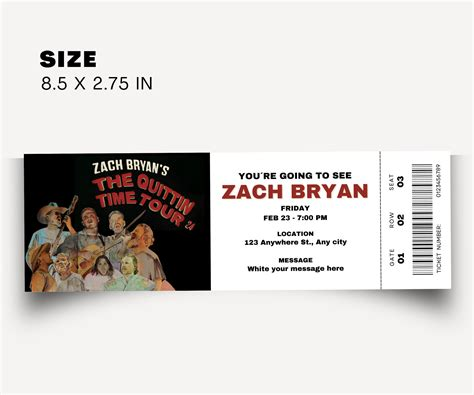

<!-- _class: cover -->
<!-- _paginate: false -->


# Week 5

## 트랜잭션 / 락 / 동시성

2026-07-04 (토) · 미션 공개 + 주간 방향

---

# 한 명씩만 🎫


---

# 지난 주 돌아보기 — Week 4 인덱스

| 항목 | 결과 |
| --- | --- |
| **제출률** | {{N}}/{{M}} 명 |
| **잘된 점** | EXPLAIN 의 `type` / `key` / `rows` 짚는 학생 다수 |
| **아쉬운 점** | _측정 1회_ 만 — p95 누락 |
| **이번 주 가져갈 것** | _동시 요청_ 으로 측정해야 _진짜_ 가 보인다 |

---

<!-- _class: quest -->

# 06-week5-concurrency

- **type**: `code`
- **마감**: 2026-07-10 (금) `23:59`
- **검증**: PR → mission-guard CI → AI 리뷰
- **통과 조건**: 실패 + 성공 로그 모두 검증 완료

> "코드 1 개에 손님 50 명이 _동시에_ 들어오면 무슨 일이 벌어질까?"

---

# 비유 — 콘서트 티켓 1장 vs 50명



티켓 1장 남았는데 50명 _동시_ 결제.

- _락 없음_ → 50명 성공 → 티켓 -49장
- _비관 락_ → 1명 성공, 49명 대기
- _낙관 락_ → 모두 시도, 1명 성공, 49명 재시도

---

# 이번 주 학습 목표

1. **음수 재고 발생** _직접_ 재현 (실패 로그 캡처)
2. **`@Lock(PESSIMISTIC_WRITE)` 또는 `@Version` 적용** + 동시 요청 50건 검증
3. **비관 vs 낙관 trade-off** — _왜 그걸 선택_ 했는지 evidence 에

---

<!-- _class: lesson -->

## 비관적 락 — 줄 서서 들어가기

```java
@Lock(PESSIMISTIC_WRITE)
@Query("SELECT p FROM Product p WHERE p.id=:id")
Optional<Product> findForUpdate(
    @Param("id") Long id);
```

```text
DB 가 SELECT ... FOR UPDATE 발행
→ 다른 트랜잭션은 이 row 를 _대기_
```

장점: _확실_. 단점: _대기 시간_.

---

<!-- _class: lesson -->

## 낙관적 락 — 일단 시도, 충돌 시 재시도

```java
@Entity
public class Product {
  @Version
  private Long version;
}
```

```text
업데이트 시 version 매칭 — 안 맞으면 예외 발생
→ 클라이언트가 다시 시도 (재시도 정책 필요)
```

장점: _경합 적을 때 빠름_. 단점: _재시도 비용_.

---

# 어떤 락 고를까

```text
경합이 _잦으면_ → 비관 락 (재시도 비용 ↑↑)
경합이 _드물면_ → 낙관 락 (대기 시간 ↑↑)
```

| 도메인 | 추천 |
| --- | --- |
| 재고 차감 (잦은 경합) | 비관 |
| 회원 정보 수정 (드문 경합) | 낙관 |
| 좋아요 / 조회수 (자주 변경) | 낙관 + 재시도 |
| 결제 / 송금 (확실해야) | 비관 |

> 면접에서 _이 trade-off_ 를 답하면 +1 점.

---

# 함정 — 동시성에서 흔한 실수

- ❌ `synchronized` 만 — 멀티 인스턴스에선 의미 X
- ❌ `@Transactional` 만 — 격리 수준 default 면 _read 충돌_ 못 막음
- ❌ 비관 락 _전체_ 적용 — 처리량 ↓↓
- ❌ 낙관 락 _재시도 정책 없음_ — 사용자에게 500 에러
- ❌ _재현 안 한_ 채 코드만 → ✅ k6 또는 ExecutorService 50 요청 _직접_ 발사

---

# 이번 주에 제출할 것

```
06-week5-concurrency/
├── report.md
├── project/                          # Spring Boot baseline + 락
└── evidence/
    ├── concurrency-failure-log.md    # 음수 재고 재현 로그
    ├── k6-script.js                  # 또는 동시 요청 스크립트
    ├── concurrency-success-log.md    # 락 적용 후 성공 로그
    └── lock-strategy-comparison.md   # 비관 vs 낙관 결정 근거
```

---

# 평가 기준 (5축)

| 축 | 가중 | 핵심 |
| --- | --- | --- |
| 요구사항 충족 | ★★ | 실패 + 성공 로그 모두 |
| 구조 | ★★ | 락 위치 / 트랜잭션 경계 |
| 기술 적용 | ★★★ | _trade-off 결정 근거_ |
| 검증 근거 | ★★★ | _재현 명령_ + 결과 횟수 |
| 설명력 | ★★ | 비관 vs 낙관 본인 말로 |

---

# 운영 안내

- **제출 마감**: 2026-07-10 (금) `23:59`
- **토 15:00–16:30**: 학생 내부 발표 (강의 슬롯 아님)
- **오피스아워**: 화·목 `21:00` `{cohort}-질문` 스레드
- **5주차 = 중도 이탈 위험 구간** — 막히면 _바로_ 질문, 혼자 끙끙 X

---

<!-- _class: end -->

# Q&A

```text
이번 주 = "내 코드에 50 명이 동시에 들어오면?"
다음 면접 = "동시성 이슈 어떻게 해결하나요?" 답할 수 있게
```

> 다음 주: **Week 6 — 서버 성능 최적화 / 프로파일링** + 격주 강의.
