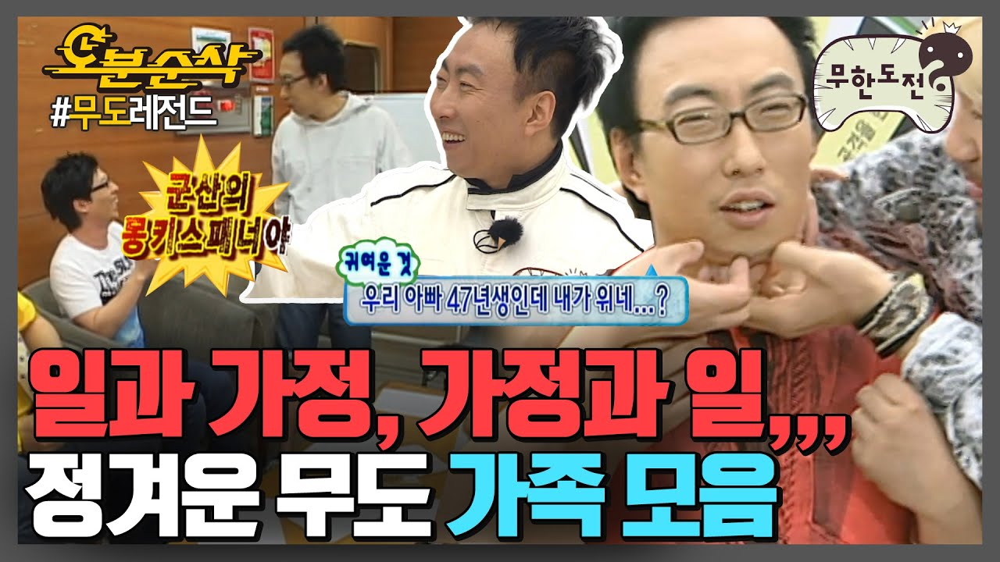

<!-- _class: cover -->
<!-- _paginate: false -->


# Week 9

## 팀 프로젝트 구현 가속

2026-08-01 (토) · 미션 공개 + 주간 방향

---

# 우리는 한 가족 (팀 프로젝트)




---

# 지난 주 돌아보기 — Week 8

| 항목 | 결과 |
| --- | --- |
| **제출률** | {{N}}/{{M}} 명 |
| **잘된 점** | hallucination 사례 _1건+_ 누적 학생 다수 |
| **아쉬운 점** | 검증 루프가 _말로만_, 흔적 약함 |
| **이번 주 가져갈 것** | _혼자_ 가 아니라 _팀_ 으로 가속 |

---

<!-- _class: quest -->

# week9-team-project

- **type**: `team_pr` (팀 레포 — 이미 부트스트랩됨)
- **마감**: 2026-08-07 (금) `23:59`
- **검증**: 팀 PR + AI 리뷰
- **통과 조건**: 개인 PR ≥ 2 + 5 단계 모두 적용 흔적 + 팀 통합 테스트

> "8주 동안 _혼자_ 한 것을, 9주차에 _팀_ 으로 한 사이클 굴린다."

---

# 비유 — 릴레이 경기


각자 _구간_, 바통 잘 넘겨야 1등.

- **A** 기획 — PRD + Jira
- **B** 코딩 — API 계약 따라 구현
- **C** 테스트 — E2E 시나리오
- **D** 리뷰 — AI Actions

> 본인 구간 + _바통 넘기기_ 가 핵심.

---

# 이번 주 학습 목표

1. **본인 기술 영역 PR ≥ 2개** — `submit/<feature>` 브랜치
2. **본인 라이프사이클 단계 1개** — 팀 산출물 1건 추가
3. **PR 본문에 5단계 체크박스 + 검증 근거** (template 강제)

---

<!-- _class: lesson -->

## 기술 영역 4 종 (4명 팀 기준)

| 팀원 | 기술 영역 | 코딩 PR |
| --- | --- | --- |
| A | 인증 / 권한 | 로그인 / 토큰 / 인가 예외 |
| B | 핵심 조회 | 검색 / 인덱스 / DTO |
| C | 동시성 / 상태전이 | 트랜잭션 / 락 / 재시도 |
| D | 캐시 / 비동기 | Redis / 이벤트 / AI 보조 |

> 3·5명 팀은 매트릭스 조정. sample: `week9-team-role-split.md`.

---

<!-- _class: lesson -->

## 라이프사이클 단계 분담

| 팀원 | 책임 단계 | 산출물 |
| --- | --- | --- |
| A | 기획 | `PRD.md` + Jira MCP 티켓 |
| B | 테스트 | `tests/e2e/` Playwright MCP |
| C | 리뷰 | `.github/workflows/ai-review.yml` |
| D | 운영 | `MONITORING.md` (Sentry MCP) |

코딩 단계 = 4명 _전원_ 공동 책임.

---

# 팀 헌법 — `CLAUDE.md` 공동 작성

W9 첫날 4명이 모여서:

- 도메인 용어 통일 (예: 주문 vs 구매)
- API 응답 형식 (camelCase / snake_case)
- 커밋 메시지 컨벤션
- AI 사용 범위 (PR 직접 vs 페어)
- 금지 사항 (예: console.log 커밋 금지)

> _합의한 규칙_ 이 곧 헌법. PR 가 헌법 어기면 reject.

---

# PR 본문 템플릿 — 강제

```markdown
## 담당 기능
- {{한 줄}}

## 라이프사이클 단계
- [x] 코딩 / [ ] 기획·테스트·리뷰·운영

## 검증
- {{evidence 인용}}

## API 변경 / AI 보조
- API-CONTRACT.md 갱신 여부
- prompt-log + hallucination 사례
```

---

# 함정 — 팀 협업에서 흔한 실수

- ❌ "내 영역만" → ✅ 코드 리뷰 _전원_ 참여
- ❌ API 계약 _말로만_ → ✅ `API-CONTRACT.md` 버전 관리
- ❌ Conflict _대충_ 머지 → ✅ 의도 확인 후 머지
- ❌ 본인 PR 만 ≥ 2 — 다른 사람 코멘트 0 → ✅ 본인 PR + 코멘트 5건+
- ❌ AI 결과 _그대로_ 머지 → ✅ 검증 루프 적용

---

# 이번 주에 제출할 것

```
{cohort}-team-NN/                 # 팀 레포
├── PRD.md                        # 기획자 책임
├── API-CONTRACT.md               # 4명 공동
├── CLAUDE.md                     # 4명 공동
├── tests/e2e/                    # 테스터 책임
├── .github/workflows/ai-review.yml  # 리뷰어 책임
├── MONITORING.md                 # 운영자 책임
└── INTEGRATION-LOG.md            # 매일 통합 로그
```

---

# 평가 기준 (5축)

| 축 | 가중 | 핵심 |
| --- | --- | --- |
| 요구사항 충족 | ★★ | 개인 PR 2+ + 5 단계 흔적 |
| 구조 | ★★ | API 계약 / 책임 분리 |
| 기술 적용 | ★★ | 6 공통 필수 기능 ≥ 1 |
| 검증 근거 | ★★★ | _협업 흔적_ (PR 댓글 / 리뷰 반영) |
| 설명력 | ★★ | 본인 영역 + 단계 본인 말로 |

> Week 9 는 _협업 흔적_ 가중. PR 댓글·리뷰·반영 로그가 evidence.

---

# 운영 안내

- **제출 마감**: 2026-08-07 (금) `23:59`
- **토 15:00–16:30**: 학생 내부 발표 (팀 PR 1건씩)
- **오피스아워**: 화·목 `21:00` `{cohort}-질문` 스레드
- **팀 데일리**: 매일 9-10분 stand-up, `INTEGRATION-LOG.md` 갱신

---

<!-- _class: end -->

# Q&A

```text
이번 주 = "혼자 8주 → 팀 1주 사이클 한 번"
다음 면접 = "팀 협업 어떻게?" 답할 수 있게
```

> 다음 주: **Week 10 — 면접 생존 챌린지** + 8/15 피날레.
